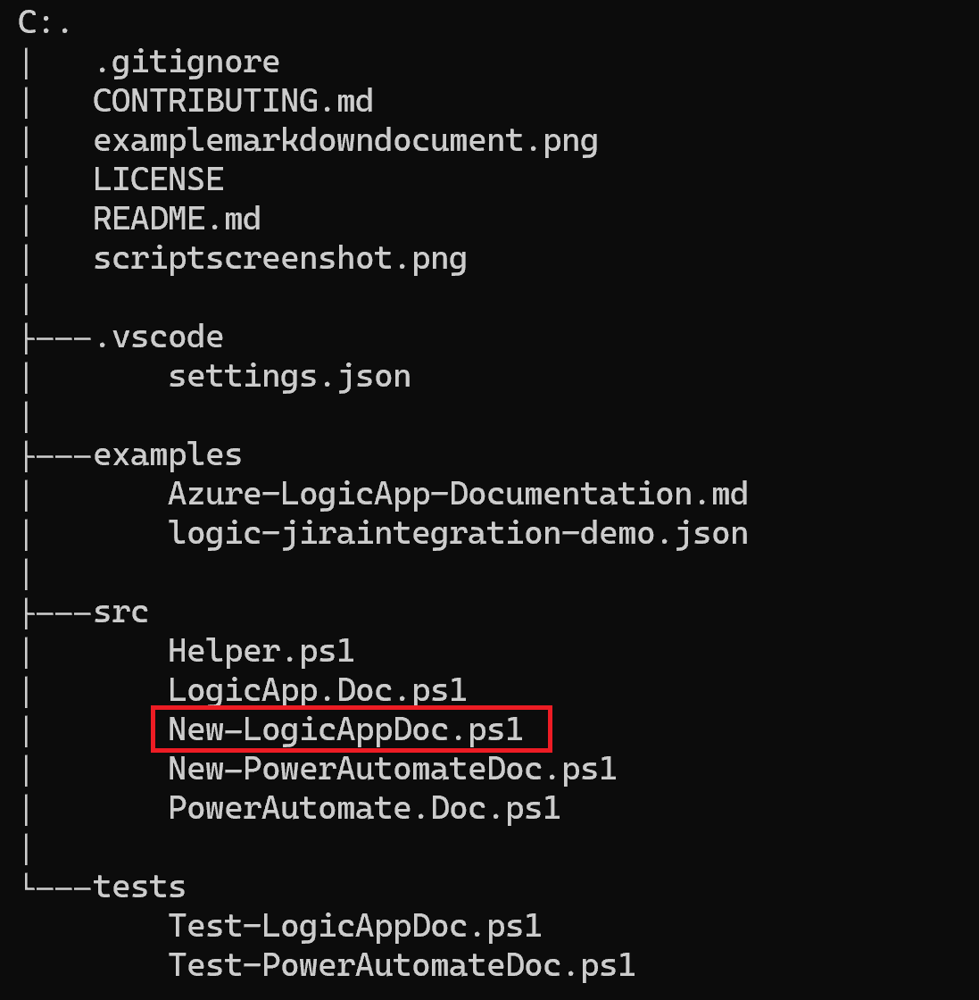
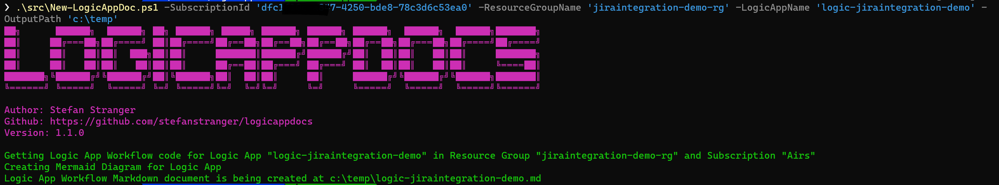
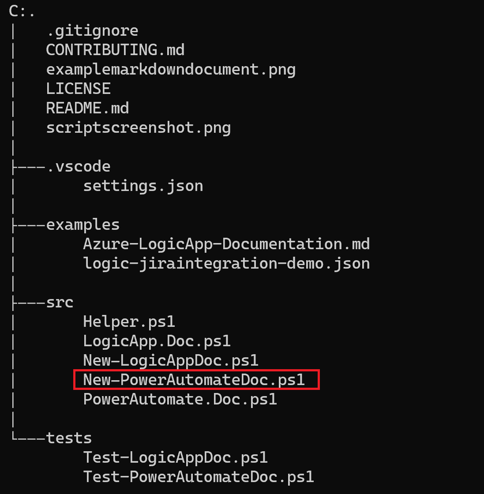
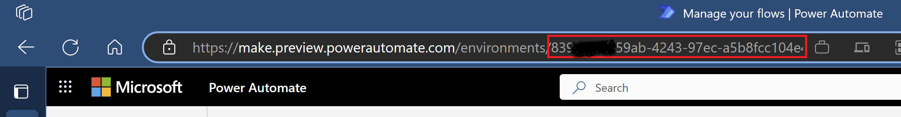
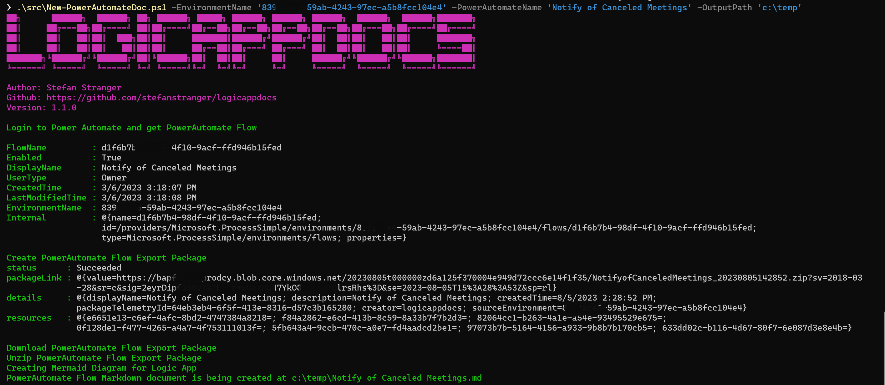

# Introduction

This solution contains scripts to generate technical documentation for <u>Azure Logic Apps</u> and <u>Power Automate Flows</u>. It uses PowerShell to retrieve the Logic App or PowerAutomate Flow and creates a Markdown file with the flow in a Mermaid Diagram and tables of the actions and connections used in the flow.

## Support

This project uses GitHub Issues to track bugs and feature requests.
Please search the existing issues before filing new issues to avoid duplicates.

- For new issues, file your bug or feature request as a new [issue](https://github.com/stefanstranger/logicappdocs/issues).
  - If you can please add the Logic App Code (json content), cleared with any sensitive information to the issue if possible.
- For help, discussion, and support questions about using this project, join or start a [discussion](https://github.com/stefanstranger/logicappdocs/discussions).

Support for this project is limited to the resources listed above.

## Getting Started

Clone the repository and run the script. The script will prompt you for the parameters. It will then create a Markdown file in the directory you provided when running the script.

```powershell
# Clone the repository
git clone https://github.com/stefanstranger/logicappdocs.git
```

## Run the New-LogicAppDoc.ps1 PowerShell script to create the Markdown file for an Azure Logic App

Navigate to the folder where you have cloned the repository and run the New-LogicAppDoc.ps1 script.



```powershell
# Authenticate to Azure where the Azure Logic App is located
Login-AzAccount -SubscriptionId <SubscriptionId>

# Run the script
# Example:
#  .\src\New-LogicAppDoc.ps1 -SubscriptionId 'dfc1f10c-a847-4250-bde8-93c3d6c53ea0' -ResourceGroupName 'jiraintegration-demo-rg' -LogicAppName 'logic-jiraintegration-demo' -OutputPath 'c:\temp' 
.\src\New-LogicAppDoc.ps1 -SubscriptionId <SubscriptionId> -ResourceGroupName <ResourceGroupName> -LogicAppName <LogicAppName> -OutputPath <OutputDirectory>
```



## Run the New-PowerAutomateDoc.ps1 PowerShell script to create the Markdown file for a Power Automate Flow

Navigate to the folder where you have cloned the repository and run the New-PowerAutomateDoc.ps1 script.



To retrieve the Power Automate Environment Id, you can login to your Power Automate Portal in your browser via https://make.preview.powerautomate.com/ and copy the environment id from the URL.



```powershell
# Run the script
# Example:
#  .\src\New-PowerAutomateDoc.ps1 -EnvironmentName '839abcd7-59ab-4243-97ec-a5b8fcc104e4' -PowerAutomateName 'Notify of Canceled Meetings'
.\src\New-PowerAutomateDoc.ps1 -EnvironmentName <Power Automate Environment Id> -PowerAutomateName <Power Automate Flow Name>
```



## Open the Markdown file

You can open the Markdown file in Visual Studio Code or any other Markdown editor.

Go to the directory where you have saved the Markdown file (OutputPath) and open the Markdown file created.

## Example - Logic App Flow


## Example - Power Automate Flow


## Credits

Special thanks and shoutouts to [Prateek Singh](https://github.com/PrateekKumarSingh) for his [Azure Visualizer tool](https://github.com/PrateekKumarSingh/AzViz). I used some of his code and inspiration to develop the LogicAppDocs script.

[Rick Strahl](https://twitter.com/rickstrahl) with some Markdown tips and tricks and for creating the awesome [Markdown Monster](https://store.west-wind.com/product/markdown_monster_3) Editor, Viewer and Weblog Publisher for Windows.

[Bernie White](https://github.com/BernieWhite) for his PowerShell PSDocs module that helps with the creation of Markdown from PowerShell objects.

[Rene Modery](https://github.com/modery/PowerDocu) for his PowerDocu script that provided ideas for this solution. PowerDocu helps generate documentation for Power App canvas apps and Power Automate flows.

[Andreas Cieslik](https://github.com/acieslik) for his feedback and help to resolve issues. Big kudos to him to help improve this solution 🙏

And finally some great PowerShell community members for their feedback and suggestions on Twitter!

## Change Log

v1.1.5 - 2024-04-02
* Bug fixes
  * [Fix for Azure DevOps wiki not supporting the mermaid diagram subgraphs. As a workaround the mermaid diagram is converted to png, using the mermaid-cli.](https://github.com/stefanstranger/logicappdocs/issues/13)
v1.1.4 - 2024-04-02
* Bug fixes
  * [Fix for issue Length cannot be less than zero.](https://github.com/stefanstranger/logicappdocs/issues/26)

v1.1.3 - 2024-03-29
* Bug fixes:
  * [Fix for actions that don't have a runafter property](https://github.com/stefanstranger/logicappdocs/issues/31)

v1.1.2 - 2023-08-18
* Bug fixes:
  * [Fix for actions with multiple runafter properties](https://github.com/stefanstranger/logicappdocs/issues/23)

v1.1.1 - 2023-08-11
* Bug fixes:
  * [Fix for issue The property '$connections' cannot be found on this object](https://github.com/stefanstranger/logicappdocs/issues/6)
  * [Fix for html code in action not correctly formatted in Actions Table](https://github.com/stefanstranger/logicappdocs/issues/9)
  * [Fix for issue when flow only contains 1 action](https://github.com/stefanstranger/logicappdocs/issues/11)
  * [Fix for issue when there cannot be any 'connectionReferences' found a Power Automate Flow](https://github.com/stefanstranger/logicappdocs/issues/15)
  * [Fix for issue when Action Input is null](https://github.com/stefanstranger/logicappdocs/issues/16)
  * [Fix for issue in Markdown Mermaid diagram output](https://github.com/stefanstranger/logicappdocs/issues/18)
  * [Fix for issue when file has unallowed chars](https://github.com/stefanstranger/logicappdocs/issues/19)


v1.1.0 - 2023-08-01
* Added logic to create Markdown documentation for Power Automate Flows.
* Changed ascii logo
* Fixed issue when no connections are configured
* Moved helper functions to separate Helper.ps1 script

v1.0.3 - 2023-08-01
* Fixed issue with Mermaid not accepting the pipe character. See [Github Issue4](https://github.com/stefanstranger/logicappdocs/issues/4)

v1.0.2 - 2023-07-27
* Fixed issue with empty actions. See Github Issue1
* Markdown file now has the same name as the Logic App Workflow name.

v1.0.1 - 2023-07-24
* Fixed issue with missing outputpath parameter.

v1.0.0 - 2023-07-10
* Initial release of the script

## Contributing

This project welcomes contributions and suggestions.
If you are ready to contribute, please visit the [contribution guide](CONTRIBUTING.md).

## Maintainers

- [Stefan Stranger](https://github.com/stefanstranger)

## License

This project is [licensed under the MIT License](LICENSE).