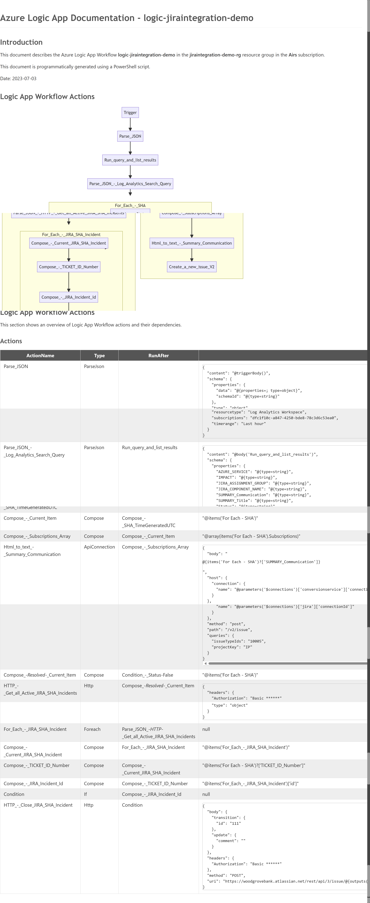

# Introduction

This is a script to generate technical documentation for Azure Logic Apps. It uses PowerShell to retrieve the Logic App Workflow code and creates a Markdown file with the workflow in a Mermaid Diagram and a table of the actions used in the workflow.

## Getting Started

Clone the repository and run the script. The script will prompt you for the parameters. It will then create a Markdown file in the directory you provided when running the script.

```powershell
# Clone the repository
git clone https://github.com/stefanstranger/logicappdocs.git
```

## Run the script

Navigate to the folder where you have cloned the repository and run the script.

```powershell
# Authenticate to Azure where the Azure Logic App is located
Login-AzAccount -SubscriptionId <SubscriptionId>

# Run the script
.\src\New-LogicAppDoc.ps1 -SubscriptionId <SubscriptionId> -ResourceGroupName <ResourceGroupName> -LogicAppName <LogicAppName> -OutputPath <OutputDirectory>
```

## Open the Markdown file

You can open the Markdown file in Visual Studio Code or any other Markdown editor.

Go to the directory where you have saved the Markdown file (OutputPath) and open the file called Azure-LogicApp-Documentation.md.

## Example



## Thanks and shoutouts

Special thanks and shoutouts to [Prateek Singh](https://github.com/PrateekKumarSingh) for his [Azure Visualizer tool](https://github.com/PrateekKumarSingh/AzViz). I used some of his code and inspiration to develop the LogicAppDocs script.

[Rick Strahl](https://twitter.com/rickstrahl) with some Markdown tips and tricks and for creating the awesome [Markdown Monster](https://store.west-wind.com/product/markdown_monster_3) Editor, Viewer and Weblog Publisher for Windows.

And finally some great PowerShell community members for their feedback and suggestions on Twitter!

## Change Log

v1.0.0 - 2023-07-10
* Initial release of the script


