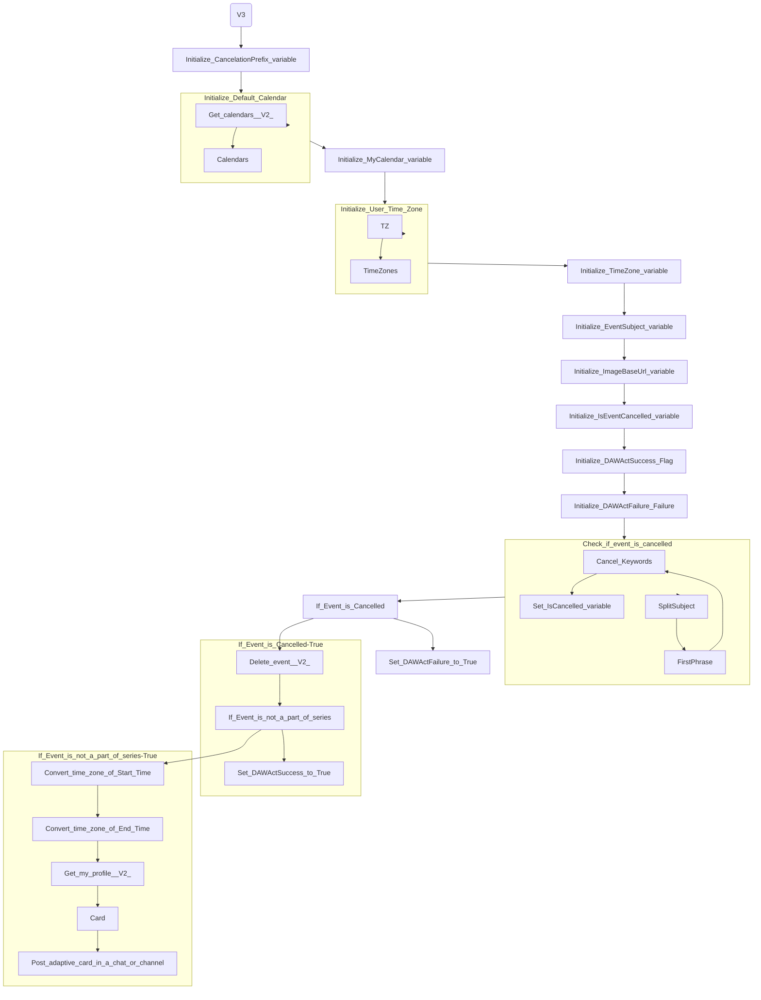

# PowerAutomate Flow Documentation - Notify of Canceled Meetings

## Introduction

This document describes the PowerAutomate Flow **Notify of Canceled Meetings** in the **839abcd7-59ab-4243-97ec-a5b8fcc104e4** Environment.

This document is programmatically generated using a PowerShell script.

Date: 2023-08-05 16:28:57

## PowerAutomate Flow Diagram

## PowerAutomate Flow Actions

This section shows an overview of PowerAutomate Flow actions and their dependencies.

### PowerAutomate Flow Triggers

| Name | Type | Inputs |
| ---- | ---- | ------ |
| When_an_event_is_added,_updated_or_deleted_(V3) | OpenApiConnectionNotification | <pre>{   "host": {     "apiId": "/providers/Microsoft.PowerApps/apis/shared_office365",     "connectionName": "shared_office365",     "operationId": "CalendarGetOnChangedItemsV3"   },   "parameters": {     "table": "********",     "incomingDays": 300,     "pastDays": 0   },   "authentication": "@parameters('$authentication')" }</pre> |

### Actions

| ActionName | Type | RunAfter | Inputs |
| ---------- | ---- | -------- | ------ |
| Initialize_CancelationPrefix_variable | InitializeVariable |  | <pre>{   "variables": [     {       "name": "CancelationPrefix",       "type": "string",       "value": "Canceled"     }   ] }</pre> |
| Initialize_Default_Calendar | Scope | Initialize_CancelationPrefix_variable | null |
| Get_calendars__V2_ | OpenApiConnection | Initialize_Default_Calendar | <pre>{   "host": {     "apiId": "/providers/Microsoft.PowerApps/apis/shared_office365",     "connectionName": "shared_office365",     "operationId": "CalendarGetTables_V2"   },   "parameters": {},   "authentication": "@parameters('$authentication')" }</pre> |
| Calendars | Query | Get_calendars__V2_ | <pre>{   "from": "@outputs('Get_calendars_(V2)')?['body/value']",   "where": "@equals(item()['isDefaultCalendar'], true)" }</pre> |
| Initialize_MyCalendar_variable | InitializeVariable | Initialize_Default_Calendar | <pre>{   "variables": [     {       "name": "MyCalendar",       "type": "string",       "value": "@{first(body('Calendars'))['Id']}"     }   ] }</pre> |
| Initialize_User_Time_Zone | Scope | Initialize_MyCalendar_variable | null |
| TZ | OpenApiConnection | Initialize_User_Time_Zone | <pre>{   "host": {     "apiId": "/providers/Microsoft.PowerApps/apis/shared_office365",     "connectionName": "shared_office365",     "operationId": "V4CalendarPostItem"   },   "parameters": {     "table": "@variables('MyCalendar')",     "item/subject": "None",     "item/start": "@utcNow()",     "item/end": "@addHours(utcNow(),-1)",     "item/timeZone": "(UTC-08:00) Pacific Time (US & Canada)"   },   "authentication": "@parameters('$authentication')" }</pre> |
| TimeZones | Compose | TZ | <pre>{   "(UTC-12:00) International Date Line West": "Dateline Standard Time",   "(UTC-11:00) Coordinated Universal Time-11": "UTC-11",   "(UTC-10:00) Aleutian Islands": "Aleutian Standard Time",   "(UTC-10:00) Hawaii": "Hawaiian Standard Time",   "(UTC-09:30) Marquesas Islands": "Marquesas Standard Time",   "(UTC-09:00) Alaska": "Alaskan Standard Time",   "(UTC-09:00) Coordinated Universal Time-09": "UTC-09",   "(UTC-08:00) Baja California": "Pacific Standard Time (Mexico)",   "(UTC-08:00) Coordinated Universal Time-08": "UTC-08",   "(UTC-08:00) Pacific Time (US & Canada)": "Pacific Standard Time",   "(UTC-07:00) Arizona": "US Mountain Standard Time",   "(UTC-07:00) Chihuahua, La Paz, Mazatlan": "Mountain Standard Time (Mexico)",   "(UTC-07:00) Mountain Time (US & Canada)": "Mountain Standard Time",   "(UTC-06:00) Central America": "Central America Standard Time",   "(UTC-06:00) Central Time (US & Canada)": "Central Standard Time",   "(UTC-06:00) Easter Island": "Easter Island Standard Time",   "(UTC-06:00) Guadalajara, Mexico City, Monterrey": "Central Standard Time (Mexico)",   "(UTC-06:00) Saskatchewan": "Canada Central Standard Time",   "(UTC-05:00) Bogota, Lima, Quito, Rio Branco": "SA Pacific Standard Time",   "(UTC-05:00) Chetumal": "Eastern Standard Time (Mexico)",   "(UTC-05:00) Eastern Time (US & Canada)": "Eastern Standard Time",   "(UTC-05:00) Haiti": "Haiti Standard Time",   "(UTC-05:00) Havana": "Cuba Standard Time",   "(UTC-05:00) Indiana (East)": "US Eastern Standard Time",   "(UTC-04:00) Asuncion": "Paraguay Standard Time",   "(UTC-04:00) Atlantic Time (Canada)": "Atlantic Standard Time",   "(UTC-04:00) Caracas": "Venezuela Standard Time",   "(UTC-04:00) Cuiaba": "Central Brazilian Standard Time",   "(UTC-04:00) Georgetown, La Paz, Manaus, San Juan": "SA Western Standard Time",   "(UTC-04:00) Santiago": "Pacific SA Standard Time",   "(UTC-04:00) Turks and Caicos": "Turks And Caicos Standard Time",   "(UTC-03:30) Newfoundland": "Newfoundland Standard Time",   "(UTC-03:00) Araguaina": "Tocantins Standard Time",   "(UTC-03:00) Brasilia": "E. South America Standard Time",   "(UTC-03:00) Cayenne, Fortaleza": "SA Eastern Standard Time",   "(UTC-03:00) City of Buenos Aires": "Argentina Standard Time",   "(UTC-03:00) Greenland": "Greenland Standard Time",   "(UTC-03:00) Montevideo": "Montevideo Standard Time",   "(UTC-03:00) Punta Arenas": "SA Eastern Standard Time",   "(UTC-03:00) Saint Pierre and Miquelon": "Saint Pierre Standard Time",   "(UTC-03:00) Salvador": "Bahia Standard Time",   "(UTC-02:00) Coordinated Universal Time-02": "UTC-02",   "(UTC-02:00) Mid-Atlantic - Old": "Mid-Atlantic Standard Time",   "(UTC-01:00) Azores": "Azores Standard Time",   "(UTC-01:00) Cabo Verde Is.": "Cape Verde Standard Time",   "(UTC) Coordinated Universal Time": "UTC",   "(UTC+00:00) Casablanca": "Morocco Standard Time",   "(UTC+00:00) Dublin, Edinburgh, Lisbon, London": "GMT Standard Time",   "(UTC+00:00) Monrovia, Reykjavik": "Greenwich Standard Time",   "(UTC+01:00) Amsterdam, Berlin, Bern, Rome, Stockholm, Vienna": "W. Europe Standard Time",   "(UTC+01:00) Belgrade, Bratislava, Budapest, Ljubljana, Prague": "Central Europe Standard Time",   "(UTC+01:00) Brussels, Copenhagen, Madrid, Paris": "Romance Standard Time",   "(UTC+01:00) Sarajevo, Skopje, Warsaw, Zagreb": "Central European Standard Time",   "(UTC+01:00) West Central Africa": "W. Central Africa Standard Time",   "(UTC+01:00) Windhoek": "Namibia Standard Time",   "(UTC+02:00) Amman": "Jordan Standard Time",   "(UTC+02:00) Athens, Bucharest": "GTB Standard Time",   "(UTC+02:00) Beirut": "Middle East Standard Time",   "(UTC+02:00) Cairo": "Egypt Standard Time",   "(UTC+02:00) Chisinau": "E. Europe Standard Time",   "(UTC+02:00) Damascus": "Syria Standard Time",   "(UTC+02:00) Gaza, Hebron": "West Bank Standard Time",   "(UTC+02:00) Harare, Pretoria": "South Africa Standard Time",   "(UTC+02:00) Helsinki, Kyiv, Riga, Sofia, Tallinn, Vilnius": "FLE Standard Time",   "(UTC+02:00) Jerusalem": "Israel Standard Time",   "(UTC+02:00) Kaliningrad": "Kaliningrad Standard Time",   "(UTC+02:00) Tripoli": "Libya Standard Time",   "(UTC+03:00) Baghdad": "Arabic Standard Time",   "(UTC+03:00) Istanbul": "Turkey Standard Time",   "(UTC+03:00) Kuwait, Riyadh": "Arab Standard Time",   "(UTC+03:00) Minsk": "Belarus Standard Time",   "(UTC+03:00) Moscow, St. Petersburg": "Russian Standard Time",   "(UTC+03:00) Nairobi": "E. Africa Standard Time",   "(UTC+03:30) Tehran": "Iran Standard Time",   "(UTC+04:00) Abu Dhabi, Muscat": "Arabian Standard Time",   "(UTC+04:00) Astrakhan, Ulyanovsk": "Astrakhan Standard Time",   "(UTC+04:00) Baku": "Azerbaijan Standard Time",   "(UTC+04:00) Izhevsk, Samara": "Russia Time Zone 3",   "(UTC+04:00) Port Louis": "Mauritius Standard Time",   "(UTC+04:00) Saratov": "Russia Time Zone 3",   "(UTC+04:00) Tbilisi": "Georgian Standard Time",   "(UTC+04:00) Volgograd": "Russian Standard Time",   "(UTC+04:00) Yerevan": "Caucasus Standard Time",   "(UTC+04:30) Kabul": "Afghanistan Standard Time",   "(UTC+05:00) Ashgabat, Tashkent": "West Asia Standard Time",   "(UTC+05:00) Ekaterinburg": "Ekaterinburg Standard Time",   "(UTC+05:00) Islamabad, Karachi": "Pakistan Standard Time",   "(UTC+05:30) Chennai, Kolkata, Mumbai, New Delhi": "India Standard Time",   "(UTC+05:30) Sri Jayawardenepura": "Sri Lanka Standard Time",   "(UTC+05:45) Kathmandu": "Nepal Standard Time",   "(UTC+06:00) Astana": "Central Asia Standard Time",   "(UTC+06:00) Dhaka": "Bangladesh Standard Time",   "(UTC+06:00) Omsk": "Central Asia Standard Time",   "(UTC+06:30) Yangon (Rangoon)": "Myanmar Standard Time",   "(UTC+07:00) Bangkok, Hanoi, Jakarta": "SE Asia Standard Time",   "(UTC+07:00) Barnaul, Gorno-Altaysk": "Altai Standard Time",   "(UTC+07:00) Hovd": "W. Mongolia Standard Time",   "(UTC+07:00) Krasnoyarsk": "North Asia Standard Time",   "(UTC+07:00) Novosibirsk": "North Asia Standard Time",   "(UTC+07:00) Tomsk": "Tomsk Standard Time",   "(UTC+08:00) Beijing, Chongqing, Hong Kong, Urumqi": "China Standard Time",   "(UTC+08:00) Irkutsk": "North Asia East Standard Time",   "(UTC+08:00) Kuala Lumpur, Singapore": "Singapore Standard Time",   "(UTC+08:00) Perth": "W. Australia Standard Time",   "(UTC+08:00) Taipei": "Taipei Standard Time",   "(UTC+08:00) Ulaanbaatar": "Ulaanbaatar Standard Time",   "(UTC+08:30) Pyongyang": "North Korea Standard Time",   "(UTC+08:45) Eucla": "Aus Central W. Standard Time",   "(UTC+09:00) Chita": "Transbaikal Standard Time",   "(UTC+09:00) Osaka, Sapporo, Tokyo": "Tokyo Standard Time",   "(UTC+09:00) Seoul": "Korea Standard Time",   "(UTC+09:00) Yakutsk": "Yakutsk Standard Time",   "(UTC+09:30) Adelaide": "Cen. Australia Standard Time",   "(UTC+09:30) Darwin": "AUS Central Standard Time",   "(UTC+10:00) Brisbane": "E. Australia Standard Time",   "(UTC+10:00) Canberra, Melbourne, Sydney": "AUS Eastern Standard Time",   "(UTC+10:00) Guam, Port Moresby": "West Pacific Standard Time",   "(UTC+10:00) Hobart": "Tasmania Standard Time",   "(UTC+10:00) Vladivostok": "Vladivostok Standard Time",   "(UTC+10:30) Lord Howe Island": "Lord Howe Standard Time",   "(UTC+11:00) Bougainville Island": "Bougainville Standard Time",   "(UTC+11:00) Chokurdakh": "Russia Time Zone 10",   "(UTC+11:00) Magadan": "Magadan Standard Time",   "(UTC+11:00) Norfolk Island": "Norfolk Standard Time",   "(UTC+11:00) Sakhalin": "Sakhalin Standard Time",   "(UTC+11:00) Solomon Is., New Caledonia": "Central Pacific Standard Time",   "(UTC+12:00) Anadyr, Petropavlovsk-Kamchatsky": "Russia Time Zone 11",   "(UTC+12:00) Auckland, Wellington": "New Zealand Standard Time",   "(UTC+12:00) Coordinated Universal Time+12": "UTC+12",   "(UTC+12:00) Fiji": "Fiji Standard Time",   "(UTC+12:00) Petropavlovsk-Kamchatsky - Old": "Kamchatka Standard Time",   "(UTC+12:45) Chatham Islands": "Chatham Islands Standard Time",   "(UTC+13:00) Coordinated Universal Time+13": "Samoa Standard Time",   "(UTC+13:00) Nuku'alofa": "Tonga Standard Time",   "(UTC+13:00) Samoa": "Samoa Standard Time",   "(UTC+14:00) Kiritimati Island": "Line Islands Standard Time" }</pre> |
| Initialize_TimeZone_variable | InitializeVariable | Initialize_User_Time_Zone | <pre>{   "variables": [     {       "name": "TimeZone",       "type": "string",       "value": "@{outputs('TimeZones')[actions('TZ')['inputs']['parameters']['item/timeZone']]}"     }   ] }</pre> |
| Initialize_EventSubject_variable | InitializeVariable | Initialize_TimeZone_variable | <pre>{   "variables": [     {       "name": "EventSubject",       "type": "string",       "value": "@{replace(replace(triggerOutputs()?['body/subject'],'\\','\\\\'),'\"','\\\"')}"     }   ] }</pre> |
| Initialize_ImageBaseUrl_variable | InitializeVariable | Initialize_EventSubject_variable | <pre>{   "variables": [     {       "name": "ImageBaseUrl",       "type": "string",       "value": "https://imageafetssa.z5.web.core.windows.net/images/EmailThumbnail.png"     }   ] }</pre> |
| Initialize_IsEventCancelled_variable | InitializeVariable | Initialize_ImageBaseUrl_variable | <pre>{   "variables": [     {       "name": "IsEventCancelled",       "type": "boolean",       "value": "@false"     }   ] }</pre> |
| Initialize_DAWActSuccess_Flag | InitializeVariable | Initialize_IsEventCancelled_variable | <pre>{   "variables": [     {       "name": "DAWActSuccess",       "type": "boolean",       "value": "@false"     }   ] }</pre> |
| Initialize_DAWActFailure_Failure | InitializeVariable | Initialize_DAWActSuccess_Flag | <pre>{   "variables": [     {       "name": "DAWActFailure",       "type": "boolean",       "value": "@false"     }   ] }</pre> |
| Check_if_event_is_cancelled | Scope | Initialize_DAWActFailure_Failure | null |
| SplitSubject | Compose | Check_if_event_is_cancelled | "@split(triggerOutputs()?['body/subject'],':')" |
| FirstPhrase | Compose | SplitSubject | "@trim(first(outputs('SplitSubject')))" |
| Cancel_Keywords | Compose | FirstPhrase | [   "Canceled",   "Abgesagt",   "Cancelada",   "取り消し",   "Cancelled",   "@{variables('CancelationPrefix')}" ] |
| Set_IsCancelled_variable | SetVariable | Cancel_Keywords | <pre>{   "name": "IsEventCancelled",   "value": "@contains(outputs('Cancel_Keywords'), outputs('FirstPhrase'))" }</pre> |
| If_Event_is_Cancelled | If | Check_if_event_is_cancelled | null |
| Delete_event__V2_ | OpenApiConnection | If_Event_is_Cancelled-True | <pre>{   "host": {     "apiId": "/providers/Microsoft.PowerApps/apis/shared_office365",     "connectionName": "shared_office365",     "operationId": "CalendarDeleteItem_V2"   },   "parameters": {     "calendar": "@trigger()['inputs']['parameters']['table']",     "event": "@triggerOutputs()?['body/id']"   },   "authentication": "@parameters('$authentication')" }</pre> |
| If_Event_is_not_a_part_of_series | If | Delete_event__V2_ | null |
| Convert_time_zone_of_Start_Time | Expression | If_Event_is_not_a_part_of_series-True | <pre>{   "baseTime": "@{triggerOutputs()?['body/start']}z",   "formatString": "f",   "sourceTimeZone": "UTC",   "destinationTimeZone": "@variables('TimeZone')" }</pre> |
| Convert_time_zone_of_End_Time | Expression | Convert_time_zone_of_Start_Time | <pre>{   "baseTime": "@{triggerOutputs()?['body/end']}z",   "formatString": "f",   "sourceTimeZone": "UTC",   "destinationTimeZone": "@variables('TimeZone')" }</pre> |
| Get_my_profile__V2_ | OpenApiConnection | Convert_time_zone_of_End_Time | <pre>{   "host": {     "apiId": "/providers/Microsoft.PowerApps/apis/shared_office365users",     "connectionName": "shared_office365users",     "operationId": "MyProfile_V2"   },   "parameters": {     "$select": "Mail"   },   "authentication": "@parameters('$authentication')" }</pre> |
| Card | Compose | Get_my_profile__V2_ | <pre>{   "type": "AdaptiveCard",   "body": [     {       "type": "ColumnSet",       "columns": [         {           "type": "Column",           "width": "auto",           "items": [             {               "type": "Image",               "url": "@{variables('ImageBaseUrl')}",               "size": "Medium",               "id": "logo",               "altText": "logo"             }           ],           "spacing": "Small"         },         {           "type": "Column",           "width": "stretch",           "items": [             {               "type": "TextBlock",               "wrap": true,               "text": "The event **@{variables('EventSubject')}** which was scheduled from **@{body('Convert_time_zone_of_Start_Time')}** to **@{body('Convert_time_zone_of_End_Time')}** has been canceled and this automation has removed the event from your calendar.",               "size": "Default"             }           ]         }       ]     },     {       "type": "TextBlock",       "text": "[Turn Off or Update Automation](https://flow.microsoft.com/manage/environments/@{workflow()?['tags']?['environmentName']}/flows/@{workflow()?['tags']?['logicAppName']}/details), [Get Help](https://aka.ms/automationsfaq), [Report An Issue](https://aka.ms/automationsreportissue), [Give Feedback](https://aka.ms/automationsfeedback), [Run Details](https://flow.microsoft.com/manage/environments/@{workflow()?['tags']?['environmentName']}/flows/@{workflow()?['tags']?['logicAppName']}/runs/@{workflow()?['run']?['name']})",       "wrap": true,       "size": "Small",       "spacing": "Small",       "weight": "Lighter"     }   ],   "$schema": "http://adaptivecards.io/schemas/adaptive-card.json",   "version": "1.3" }</pre> |
| Post_adaptive_card_in_a_chat_or_channel | OpenApiConnection | Card | <pre>{   "host": {     "apiId": "/providers/Microsoft.PowerApps/apis/shared_teams",     "connectionName": "shared_teams",     "operationId": "PostCardToConversation"   },   "parameters": {     "poster": "Flow bot",     "location": "Chat with Flow bot",     "body/recipient": "@{outputs('Get_my_profile_(V2)')?['body/mail']};",     "body/messageBody": "@outputs('Card')"   },   "authentication": "@parameters('$authentication')" }</pre> |
| Set_DAWActFailure_to_True | SetVariable | If_Event_is_Cancelled | <pre>{   "name": "DAWActFailure",   "value": "@true" }</pre> |
| Set_DAWActSuccess_to_True | SetVariable | If_Event_is_Cancelled-True | <pre>{   "name": "DAWActSuccess",   "value": "@true" }</pre> |

## PowerAutomate Flow Connections

This section shows an overview of PowerAutomate Flow connections.

### Connections

| ConnectionName | ConnectionId |
| -------------- | ------------ |
| shared-office365-7f77safe-18d0-4f86-ada7-ae5d756b96e9 | /providers/Microsoft.PowerApps/apis/shared_office365 |
| 2afc0e3e83f241asdf8c182e910085055c | /providers/Microsoft.PowerApps/apis/shared_office365users |
| shared-teams-69ea0166-7e4f-4033-b861-c64a30c2cb27 | /providers/Microsoft.PowerApps/apis/shared_teams |
